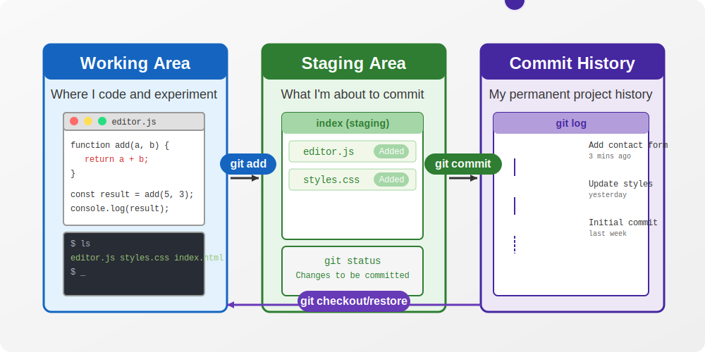

# Git: Zero to Professional Reference Guide

A comprehensive handbook for mastering Git version control - drawn from my personal experience using Git with VS Code across numerous projects.

## Introduction to Git

I've been using Git for years, and trust me, once you get the hang of it, you'll wonder how you ever lived without it. Git is a distributed version control system that tracks changes in your code, letting you and your team work together without stepping on each other's toes.

**Key Concepts I Use Daily:**

- **Commit**: Think of this as a savepoint in a game - you can always go back to it
- **Branch**: Where I experiment with new features without breaking my working code
- **Repository**: The entire project folder with all its history
- **Remote**: Where I push my code so my teammates can access it (usually GitHub)

## Basic Command Line Navigation

Even though I mostly use VS Code's Git integration now, I still find myself using these terminal commands regularly:

| Command | What I Use It For | Example |
| --- | --- | --- |
| `ls` | Quick check of what's in my current folder | `ls` |
| `cd` | Jumping between project directories | `cd ~/projects/client-website` |
| `mkdir` | Creating new project folders | `mkdir new-microservice` |
| `pwd` | Double-checking where I am when I get lost | `pwd` |

> Pro tip: I've set up tab completion for Git commands in my terminal - saves me tons of typing mistakes!
>

## Git Configuration

Setting up your identity is crucial for proper attribution of commits:
```
# Configure username globally
git config --global user.name "Your Name"

# Configure email globally
git config --global user.email "email@example.com"

# Configure default branch name
git config --global init.defaultBranch main

# Create useful aliases
git config --global alias.s "status"   # Now you can use: git s
git config --global alias.lg "log --all --graph --oneline"
```
## The Three Git Areas

Understanding these three areas clicked for me after I messed up a few commits:



1. **Working Area**: Where I make all my changes and tests
2. **Staging Area**: The "review before commit" space where I organize what goes into each commit
3. **Commit History**: My project's timeline - every checkpoint I've created

## Creating and Managing Commits

### My Daily Git Workflow

| Command | How I Use It | Movement |
|---------|-------------|----------|
| `git init` | Starting new projects (though I often use VS Code's UI for this now) | Creates `.git` folder |
| `git status` | I check this constantly - my most used command by far | - |
| `git add file.js` | Adding specific files when I don't want to stage everything | Working → Staging |
| `git add .` | When I'm ready to commit all my changes | Working → Staging |
| `git commit -m "Add user authentication"` | Creating checkpoints with clear descriptions | Staging → History |
| `git reset file.js` | When I accidentally stage something I'm not ready to commit | Staging → Working |
| `git checkout -- file.js` | Discarding experiments that didn't work out | Removes changes |

### Saving My Neck with Advanced Commits

```bash
# I use this all the time when I forgot to add a file to a commit
git commit --amend -m "Add user authentication with validation"

# This interactive staging has saved me from committing debug code countless times
git add -p

# Before committing, I always run a diff to double-check what I'm about to commit
git diff --staged
```

## Viewing and Navigating History

### Inspecting Past Work

```bash
# Basic history check
git log

# This graph view is my go-to for understanding branch structures
git log --all --graph --oneline --decorate

# When I need to find out who changed a specific line (and why!)
git blame file.js

# After a merge went bad, this helped me see what exactly happened
git show a72f6d
```


### Time Travel

```bash
# Testing how code worked at a specific point in time
git checkout a72f6d

# The number of times this has saved me from accidental deletions...
git checkout main -- src/helpers/format.js

# When a feature branch went completely wrong and I needed to start over
git checkout a72f6d .
```

## Branching Strategies

I create branches for literally everything now - even tiny changes:

```bash
# See what branches exist and which one I'm on
git branch

# Creating a new feature branch (but staying on current branch)
git branch feature/user-profiles

# What I use 95% of the time - create and switch in one command
git checkout -b hotfix/login-crash

# Switching branches to work on something else
git checkout main

# Cleaning up after a merged PR
git branch -d feature/user-profiles

# When I abandoned an approach completely
git branch -D feature/bad-idea
```

### How I Visualize Branches

```
                 feature/login
                   ↓
main o-------o-----o---o---o
       \             ↑    /
        o---o---o---o----o
            ↑
         hotfix/crash
```

## Merging and Resolving Conflicts

### Basic Merging

```bash
# After completing a feature, bringing it into main
git checkout main
git merge feature/login --no-ff -m "Implement user login flow"
```

### Dealing with Merge Conflicts

When I see this, I know my next 20 minutes are spoken for:

```
<<<<<<< HEAD
const timeout = 3000; // Increased for slow connections
=======
const timeout = 1000; // Faster response times
>>>>>>> feature/performance
```
