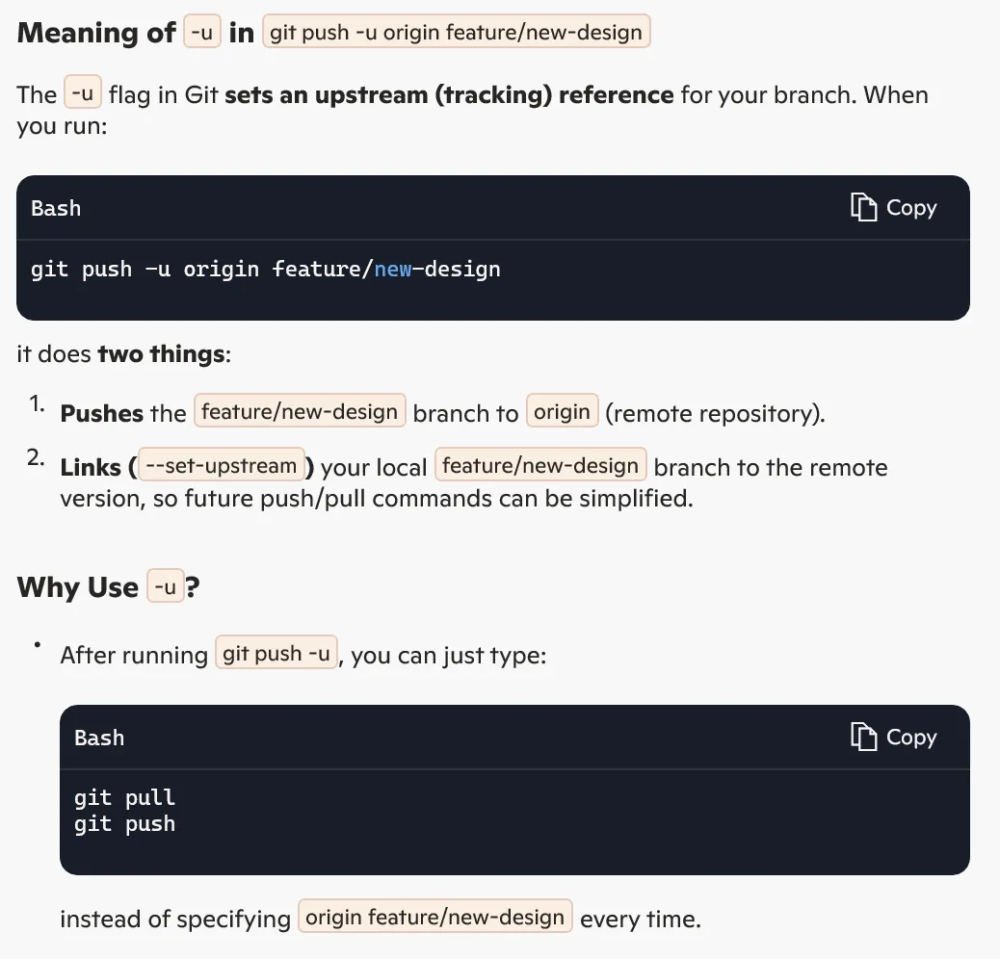

# Git: Zero to Professional Reference Guide

A comprehensive handbook for mastering Git version control - drawn from my personal experience using Git with VS Code across numerous projects.

## Introduction to Git

I've been using Git for years, and trust me, once you get the hang of it, you'll wonder how you ever lived without it. Git is a distributed version control system that tracks changes in your code, letting you and your team work together without stepping on each other's toes.

**Key Concepts I Use Daily:**

- **Commit**: Think of this as a savepoint in a game - you can always go back to it
- **Branch**: Where I experiment with new features without breaking my working code
- **Repository**: The entire project folder with all its history
- **Remote**: Where I push my code so my teammates can access it (usually GitHub)

## Basic Command Line Navigation

Even though I mostly use VS Code's Git integration now, I still find myself using these terminal commands regularly:

| Command | What I Use It For | Example |
| --- | --- | --- |
| `ls` | Quick check of what's in my current folder | `ls` |
| `cd` | Jumping between project directories | `cd ~/projects/client-website` |
| `mkdir` | Creating new project folders | `mkdir new-microservice` |
| `pwd` | Double-checking where I am when I get lost | `pwd` |

> Pro tip: I've set up tab completion for Git commands in my terminal - saves me tons of typing mistakes!
>

## Git Configuration

Setting up your identity is crucial for proper attribution of commits:
```
# Configure username globally
git config --global user.name "Your Name"

# Configure email globally
git config --global user.email "email@example.com"

# Configure default branch name
git config --global init.defaultBranch main

# Create useful aliases
git config --global alias.s "status"   # Now you can use: git s
git config --global alias.lg "log --all --graph --oneline"
```
## The Three Git Areas

Understanding these three areas clicked for me after I messed up a few commits:


1. **Working Area**: Where I make all my changes and tests
2. **Staging Area**: The "review before commit" space where I organize what goes into each commit
3. **Commit History**: My project's timeline - every checkpoint I've created

## Creating and Managing Commits

### My Daily Git Workflow

| Command | How I Use It | Movement |
|---------|-------------|----------|
| `git init` | Starting new projects (though I often use VS Code's UI for this now) | Creates `.git` folder |
| `git status` | I check this constantly - my most used command by far | - |
| `git add file.js` | Adding specific files when I don't want to stage everything | Working → Staging |
| `git add .` | When I'm ready to commit all my changes | Working → Staging |
| `git commit -m "Add user authentication"` | Creating checkpoints with clear descriptions | Staging → History |
| `git reset file.js` | When I accidentally stage something I'm not ready to commit | Staging → Working |
| `git checkout -- file.js` | Discarding experiments that didn't work out | Removes changes |

### Saving My Neck with Advanced Commits

```bash
# I use this all the time when I forgot to add a file to a commit
git commit --amend -m "Add user authentication with validation"

# This interactive staging has saved me from committing debug code countless times
git add -p

# Before committing, I always run a diff to double-check what I'm about to commit
git diff --staged
```

## Viewing and Navigating History

### Inspecting Past Work

```bash
# Basic history check
git log

# This graph view is my go-to for understanding branch structures
git log --all --graph --oneline --decorate

# When I need to find out who changed a specific line (and why!)
git blame file.js

# After a merge went bad, this helped me see what exactly happened
git show a72f6d
```


### Time Travel

```bash
# Testing how code worked at a specific point in time
git checkout a72f6d

# The number of times this has saved me from accidental deletions...
git checkout main -- src/helpers/format.js

# When a feature branch went completely wrong and I needed to start over
git checkout a72f6d .
```

## Branching Strategies

I create branches for literally everything now - even tiny changes:

```bash
# See what branches exist and which one I'm on
git branch

# Creating a new feature branch (but staying on current branch)
git branch feature/user-profiles

# What I use 95% of the time - create and switch in one command
git checkout -b hotfix/login-crash

# Switching branches to work on something else
git checkout main

# Cleaning up after a merged PR
git branch -d feature/user-profiles

# When I abandoned an approach completely
git branch -D feature/bad-idea
```

### How I Visualize Branches

```
                 feature/login
                   ↓
main o-------o-----o---o---o
       \             ↑    /
        o---o---o---o----o
            ↑
         hotfix/crash
```

## Merging and Resolving Conflicts

### Basic Merging

```bash
# After completing a feature, bringing it into main
git checkout main
git merge feature/login --no-ff -m "Implement user login flow"
```

### Dealing with Merge Conflicts

When I see this, I know my next 20 minutes are spoken for:

```
<<<<<<< HEAD
const timeout = 3000; // Increased for slow connections
=======
const timeout = 1000; // Faster response times
>>>>>>> feature/performance
```

**My conflict resolution workflow:**

1. First, I don't panic (learned that the hard way)
2. I open the files in VS Code, which highlights conflicts beautifully
3. I review each change carefully, sometimes consulting with the original developers
4. After choosing the correct code, I remove all those markers
5. Stage and commit: `git add .` followed by `git commit`

## Remote Repositories with GitHub

### Setting Up Remotes

```bash
# Linking my local repo to GitHub after creating a new repo there
git remote add origin <https://github.com/username/repo.git>

# Checking my remote connections (I do this to verify before pushing)
git remote -v

# When I need to switch to a different remote (like after forking)
git remote remove origin
git remote add origin <https://github.com/myusername/forked-repo.git>
```

### Syncing with Remote Repositories

```bash
# Starting work on an existing project
git clone <https://github.com/company/project.git>

# Pushing my new feature branch to share with the team for review
git push origin feature/new-design

# This is my go-to for setting up tracking - saves tons of typing later
git push -u origin feature/new-design

# Checking for team updates without integrating them yet
git fetch origin

# Getting latest changes before starting new work (I do this every morning)
git pull origin main
```



## Professional Git Workflows

### Feature Branch Workflow

This is how my team and I work every day:

1. **Create a feature branch**
    
    ```bash
    git checkout -b feature/payment-integration
    # Code, test, refactor...
    git add .
    git commit -m "Add Stripe payment processing"
    ```
    
2. **Push feature branch for code review**
    
    ```bash
    git push -u origin feature/payment-integration
    ```
    
3. **Create Pull Request on GitHub**
    - I usually add screenshots and testing notes to my PRs
    - Always tag relevant team members for review
4. **Address feedback from code review**
    
    ```bash
    # Making changes based on comments
    git add .
    git commit -m "Refactor payment handler per review"
    git push
    ```
    
5. **Update with latest main changes**
    
    ```bash
    # This prevents merge conflicts later - I do it daily
    git checkout main
    git pull
    git checkout feature/payment-integration
    git merge main
    # Resolve any conflicts
    git push
    ```
    
6. **After approval, merge via GitHub**
    - I prefer "Squash and merge" for cleaner history
    - Delete the branch on GitHub after merging
7. **Clean up locally**
    
    ```bash
    git checkout main
    git pull
    git branch -d feature/payment-integration
    ```
    

## Git Best Practices

1. **Commit Messages**
    - I write messages as if explaining what the code does to a teammate
    - First line under 50 chars: "Fix authentication timeout issue"
    - Add details if needed: "Increases token validity to prevent logouts during form submission"
    - Always reference ticket numbers: "Fixes #123"
2. **Commit Frequency**
    - I commit whenever I complete a logical unit of work
    - Small, focused commits make code reviews and bug hunting much easier
    - If my commit message needs "and" - it should be two commits
3. **Branch Management**
    - I use prefixes to keep branches organized: `feature/`, `fix/`, `refactor/`
    - Delete branches after merging to prevent clutter
    - Update from main at least once a day to prevent massive merge conflicts
4. **.gitignore**
I keep a template with these common exclusions:
    - Build outputs (`/dist`, `/build`)
    - Dependencies (`/node_modules`, `/vendor`)
    - Environment files (`.env`, `.env.local`)
    - Editor files (`.vscode/`, `.idea/`)
    - OS files (`.DS_Store`, `Thumbs.db`)


**4. Best Practices for Git & GitHub Integration**

To work efficiently in professional environments, teams follow these best practices:

- **Use meaningful branch names** (`feature-login`, `bugfix-404-error`).
- **Commit often with clear messages** (`Fixed UI alignment in navbar`).
- **Write Pull Request descriptions clearly** (What was changed and why).
- **Automate testing** using CI/CD (GitHub Actions, Jenkins, CircleCI).
- **Keep repository clean** by deleting merged branches.

This feature branch workflow is widely used in companies, startups, and open-source projects to manage development efficiently.

## Advanced Git Techniques

### Stashing Changes

```bash
# When my boss comes by and needs an urgent fix on another branch
git stash save "WIP: User profile feature"

# Finding the right stash after coming back
git stash list

# Applying my stashed changes without removing the stash (just in case)
git stash apply stash@{0}

# When I'm confident everything is working
git stash pop

# When my stashed work deserves its own branch
git stash branch feature/user-profiles stash@{0}
```

### Cleaning Up History

```bash
# Cleaning up my local commits before sharing (I do this a lot)
git rebase -i HEAD~3

# Squashing a bunch of "WIP" commits into a clean one
git rebase -i main  # Then mark commits as 'squash' or 'fixup'

# Grabbing a specific bug fix from another branch
git cherry-pick a72f6d

# When I've pushed to the wrong branch and need to undo
git reset --hard origin/main
```

### Reflog - My Safety Net

```bash
# This has saved me more than once after a bad rebase or reset
git reflog

# Recovering work I thought was lost forever
git checkout -b recovery a72f6d
```

## Git with VS Code

After years of command-line Git, discovering VS Code's Git integration was a game-changer for my workflow:

### Source Control Panel

- The Source Control tab gives me a clear view of all changed files
- I can stage changes with a click instead of typing `git add`
- Seeing diffs side-by-side makes reviewing changes much easier
- The commit input box supports multi-line messages with proper formatting

### Integrated Terminal

- When I need command-line Git power, I just press `Ctrl+`` to open the terminal
- I can run complex Git commands while still seeing my code
- The terminal remembers my Git command history between sessions

### Extensions (VsCode) that Changed My Git Life

- **GitLens**: Lets me see who changed each line and when (blame annotations)
- **Git History**: Visualizes the commit history with a beautiful graph
- **Git Graph**: Another great way to visualize branches and merges

### My VS Code Git Workflow

1. Make code changes in the editor
2. `Ctrl+Shift+G` to open Source Control
3. Hover over files to see changes with "+" button to stage
4. Enter commit message and press `Ctrl+Enter` to commit
5. Click "..." for additional options like Push/Pull
6. Use the status bar branch indicator to create/switch branches

### Keyboard Shortcuts I Use Daily

- `Ctrl+Shift+G`: Open Source Control view
- `Alt+Enter` on a changed file: Stage the file
- `Ctrl+Enter` in commit message: Commit staged changes
- `F1` then "git pull": Pull from remote
- `F1` then "git push": Push to remote

---

I hope this guide helps you as much as building these skills has helped me. Git has a learning curve, but stick with it - I went from fearing merge conflicts to confidently fixing them in front of clients. The time investment pays off every single day.